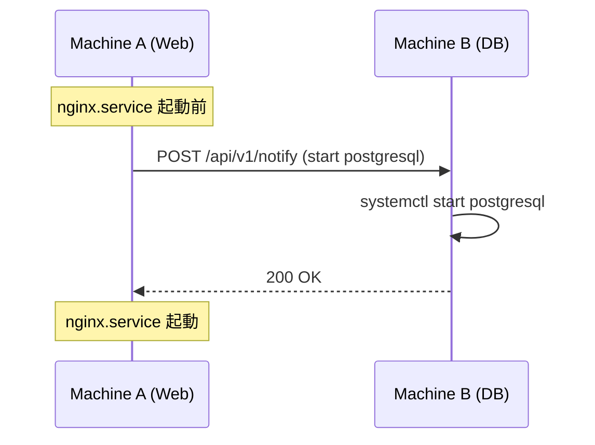

# shiki

<p align="center">
  
</p>

<h1 align="center">S.H.I.K.I.</h1>
<p align="center">
  <strong>System Handoff & Inter-node Kickoff Initiator.</strong><br>
  A cross-host sequence orchestrator that extends systemd beyond a single machine.
</p>

[](https://github.com/pirakansa/shiki/actions/workflows/ci.yml)
[](https://opensource.org/licenses/MIT)

**shiki** は、複数マシン間で systemd サービスの起動順序を HTTP ベースで連携させる軽量ツールです。

---

## 特徴

- **REST API ベース**: シンプルな HTTP リクエストで次のノードに起動指示を送信
- **軽量エージェント**: 静的リンクされた単一バイナリ、Docker 内でも動作
- **柔軟な連携**: 既存の systemd ユニットファイルと併用して、マシン間の依存関係を構築
- **シンプルな設定**: YAML 形式の設定ファイル

---

## ユースケース



- Web サーバー起動前に、別マシンの DB サーバーを起動
- マイクロサービスの起動順序制御
- Docker Compose では難しいマルチホスト連携

---

## クイックスタート

### 1. インストール

```bash
# バイナリをダウンロード（リリース後）
curl -L https://github.com/pirakansa/shiki/releases/latest/download/shiki-linux-amd64 -o shiki
chmod +x shiki
sudo mv shiki /usr/local/bin/
```

### 2. 設定ファイルを作成

```bash
sudo mkdir -p /etc/shiki
sudo cp docs/examples/config.example.yaml /etc/shiki/config.yaml
sudo vim /etc/shiki/config.yaml
```

### 3. エージェントを起動

```bash
# フォアグラウンドで起動（テスト用）
shiki serve

# または systemd サービスとして起動
sudo systemctl enable --now shiki
```

### 4. 通知を送信

```bash
# 別マシンのサービスを起動
shiki notify \
    --target remote-server:8080 \
    --action start \
    --service nginx \
    --wait
```

### 5. systemd ユニットで連携

```ini
# /etc/systemd/system/myapp.service
[Service]
ExecStartPre=/usr/local/bin/shiki notify \
    --target db-server:8080 \
    --action start \
    --service postgresql \
    --wait

ExecStart=/usr/local/bin/myapp
```

---

## ドキュメント

| ドキュメント | 内容 |
|--------------|------|
| [DESIGN.md](docs/DESIGN.md) | アーキテクチャ設計書 |
| [SPECIFICATION.md](docs/SPECIFICATION.md) | 機能仕様書 |
| [API.md](docs/API.md) | REST API リファレンス |
| [CONFIGURATION.md](docs/CONFIGURATION.md) | 設定リファレンス |
| [SYSTEMD_INTEGRATION.md](docs/SYSTEMD_INTEGRATION.md) | systemd 連携ガイド |

---

## 開発

### 必要環境

- Rust 1.70+
- Linux (systemd)

### ビルド

```bash
# 開発ビルド
make build

# リリースビルド
make release

# テスト
make test

# リント
make lint
```

### プロジェクト構造

```
.
├── src/
│   ├── main.rs          # エントリーポイント
│   └── lib.rs           # ライブラリ
├── docs/
│   ├── DESIGN.md        # 設計書
│   ├── SPECIFICATION.md # 仕様書
│   ├── API.md           # API リファレンス
│   ├── CONFIGURATION.md # 設定リファレンス
│   ├── SYSTEMD_INTEGRATION.md # systemd 連携
│   └── examples/
│       └── config.example.yaml
├── tests/               # 統合テスト
├── Cargo.toml
├── Makefile
└── README.md
```

---

## ライセンス

MIT License - 詳細は [LICENSE](LICENSE) を参照してください。

---

## 貢献

Issue や Pull Request を歓迎します。詳細は [AGENTS.md](AGENTS.md) を参照してください