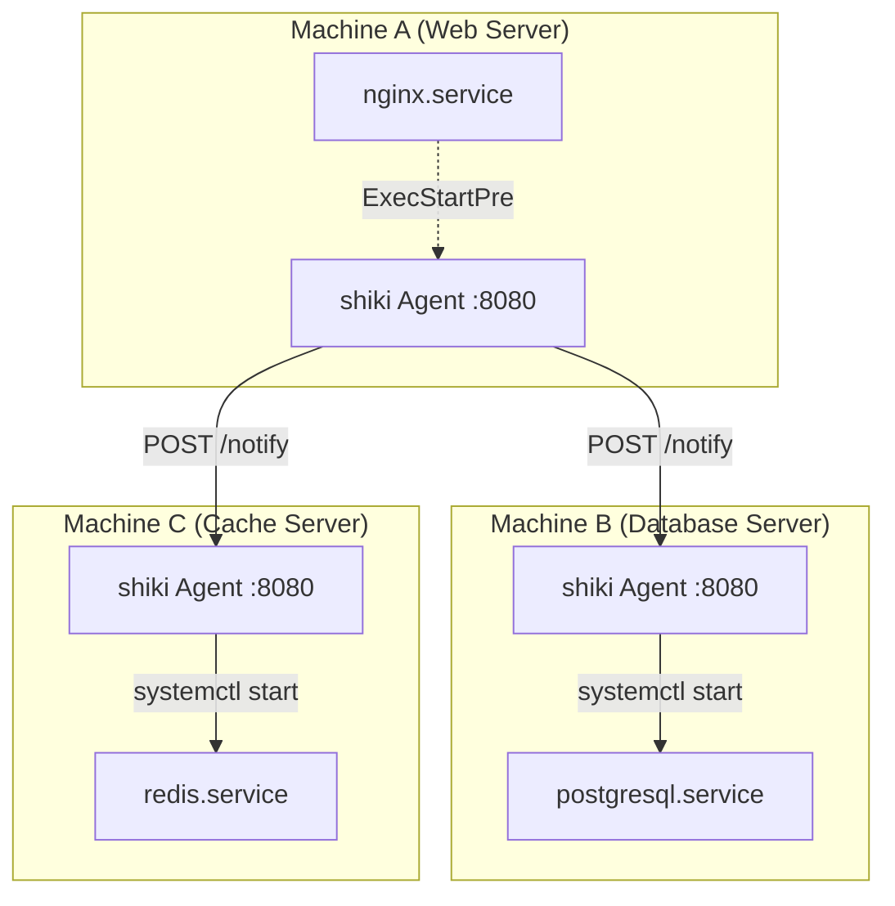
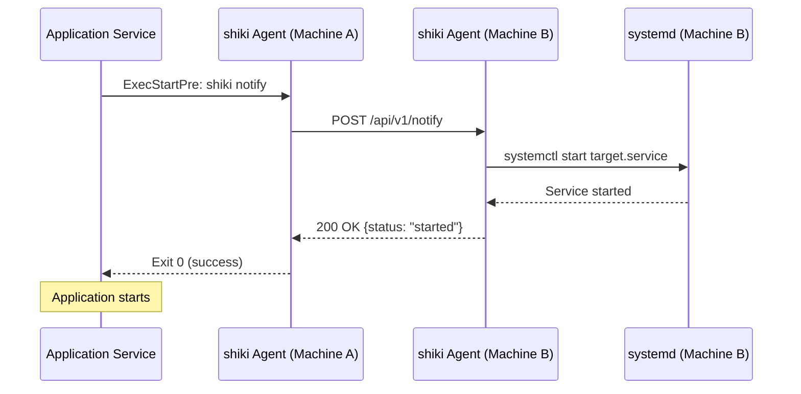
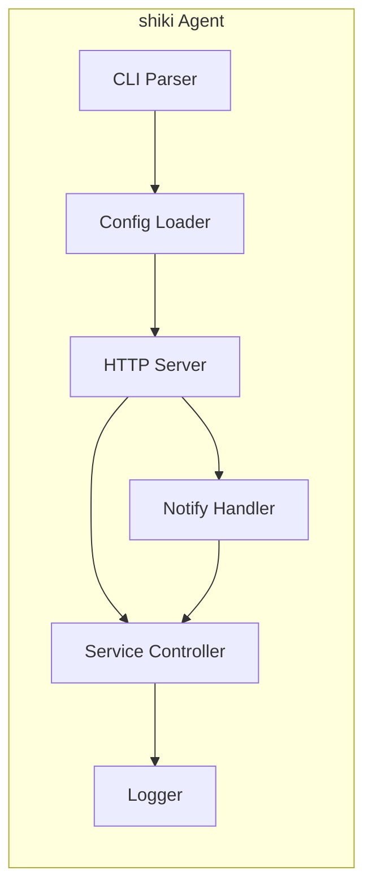

# DESIGN.md - shiki アーキテクチャ設計書

> **Version**: 0.1.0  
> **Last Updated**: 2025-12-30  
> **Status**: Draft

---

## 1. 概要

### 1.1 目的

shiki は、**複数マシン間での systemd サービス起動順序を HTTP ベースで連携させる**ための軽量ツールです。

systemd 単体では単一マシン内の依存関係しか制御できませんが、shiki を導入することで、ネットワーク越しに「Machine A のサービスが起動したら Machine B のサービスを起動する」といった連携が可能になります。

### 1.2 設計原則

| 原則 | 説明 |
|------|------|
| **シンプルさ** | REST API と YAML 設定のみで動作。複雑なオーケストレーションは行わない |
| **軽量性** | 静的リンクされた単一バイナリ。メモリ使用量は最小限 |
| **汎用性** | ホスト環境でも Docker コンテナ内でも動作可能 |
| **非侵襲性** | 既存の systemd ユニットファイルを変更せず、ExecStartPre/Post で連携 |
| **可観測性** | 構造化ログと状態 API により、動作状況を把握しやすい |

### 1.3 用語定義

| 用語 | 定義 |
|------|------|
| **Agent** | 各マシン上で動作する shiki の常駐プロセス。HTTP サーバーとして起動指示を受け付ける |
| **Notify** | あるエージェントから別のエージェントへサービス起動/停止を依頼する HTTP リクエスト |
| **Target** | 通知先のエージェントのアドレス（host:port） |
| **Service** | systemd で管理されるユニット（例: nginx.service） |

---

## 2. システムアーキテクチャ

### 2.1 全体構成図



### 2.2 デプロイメントパターン

#### パターン A: ホスト直接インストール

```
┌─────────────────────────────────┐
│           Host OS               │
│  ┌─────────┐    ┌────────────┐  │
│  │ shiki   │    │ systemd    │  │
│  │ agent   │───▶│ services   │  │
│  └─────────┘    └────────────┘  │
└─────────────────────────────────┘
```

#### パターン B: Docker コンテナ内

```
┌─────────────────────────────────┐
│           Host OS               │
│  ┌─────────────────────────┐    │
│  │    Docker Container     │    │
│  │  ┌─────────┐            │    │
│  │  │ shiki   │            │    │
│  │  │ agent   │───────────────▶ │ Host systemd
│  │  └─────────┘            │    │
│  └─────────────────────────┘    │
└─────────────────────────────────┘
```

### 2.3 通信フロー



---

## 3. コンポーネント設計

### 3.1 コンポーネント構成図



### 3.2 主要コンポーネント

| コンポーネント | 責務 | 主な依存 crate |
|----------------|------|----------------|
| **CLI Parser** | コマンドライン引数の解析 | `clap` |
| **Config Loader** | YAML 設定ファイルの読み込み・検証 | `serde_yaml` |
| **HTTP Server** | REST API エンドポイントの提供 | `axum` |
| **Notify Handler** | 他エージェントへの通知送信 | `reqwest` |
| **Service Controller** | systemd サービスの操作 | `std::process::Command` |
| **Logger** | 構造化ログ出力 | `tracing` |

### 3.3 モジュール構成（予定）

```
src/
├── main.rs              # エントリーポイント
├── lib.rs               # ライブラリルート
├── cli.rs               # CLI 定義
├── config.rs            # 設定構造体・ローダー
├── server/
│   ├── mod.rs           # HTTP サーバー
│   ├── routes.rs        # ルーティング定義
│   └── handlers.rs      # リクエストハンドラ
├── notify.rs            # 通知送信ロジック
├── service.rs           # systemd 操作
└── error.rs             # エラー型定義
```

---

## 4. 技術選定

| 領域 | 選定技術 | 選定理由 |
|------|---------|----------|
| 言語 | Rust | 軽量バイナリ、メモリ安全性、クロスコンパイル容易 |
| HTTP Server | axum | 軽量、async 対応、Tower エコシステム |
| HTTP Client | reqwest | 使いやすい API、async 対応 |
| Config Parser | serde_yaml | serde エコシステム、YAML 標準対応 |
| CLI Parser | clap | 豊富な機能、derive マクロ対応 |
| Logging | tracing | 構造化ログ、async 対応 |
| Error Handling | thiserror | 軽量なエラー型定義 |
| Async Runtime | tokio | デファクトスタンダード |

---

## 5. 今後の拡張ポイント

以下は初期リリース後に検討する機能です：

- [ ] **TLS 対応**: HTTPS 通信の暗号化
- [ ] **認証機能**: Bearer トークン / mTLS による認証
- [ ] **クラスタモード**: 複数エージェント間の自動検出・連携
- [ ] **Web UI**: 状態確認用のダッシュボード
- [ ] **永続化**: 状態の SQLite 保存

---

## 関連ドキュメント

- [SPECIFICATION.md](SPECIFICATION.md) - 機能仕様書
- [API.md](API.md) - REST API リファレンス
- [CONFIGURATION.md](CONFIGURATION.md) - 設定リファレンス
- [SYSTEMD_INTEGRATION.md](SYSTEMD_INTEGRATION.md) - systemd 連携ガイド
