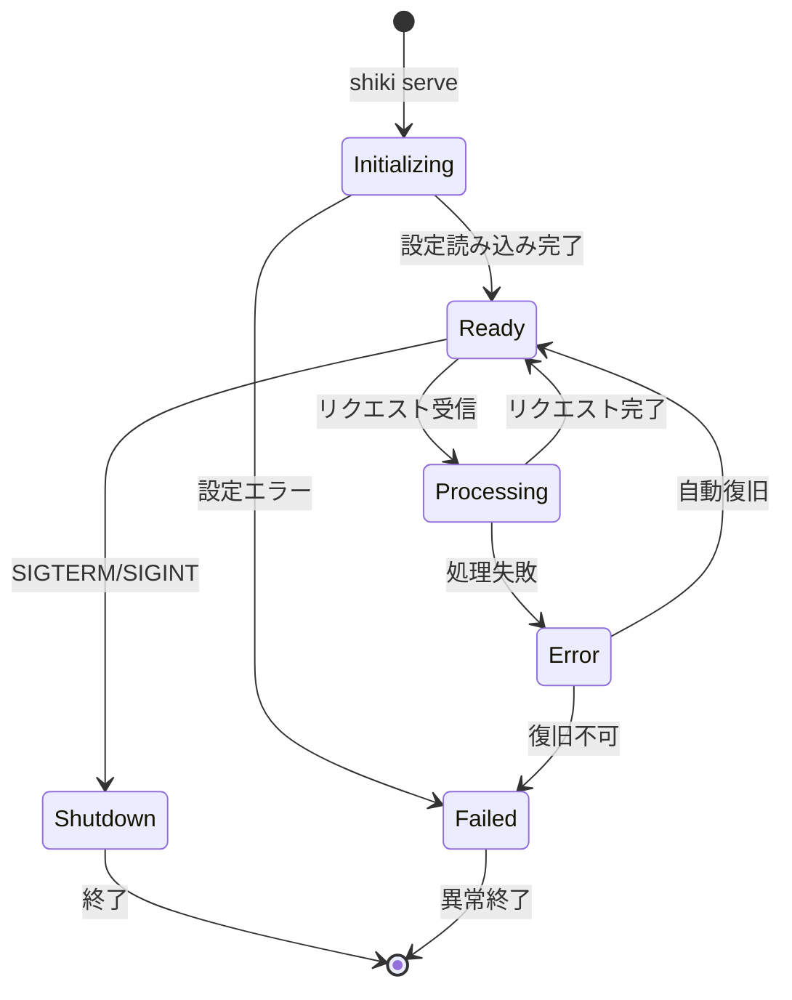
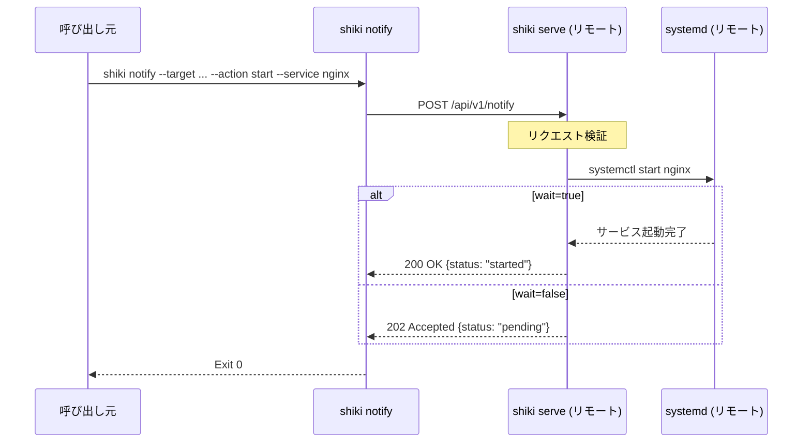
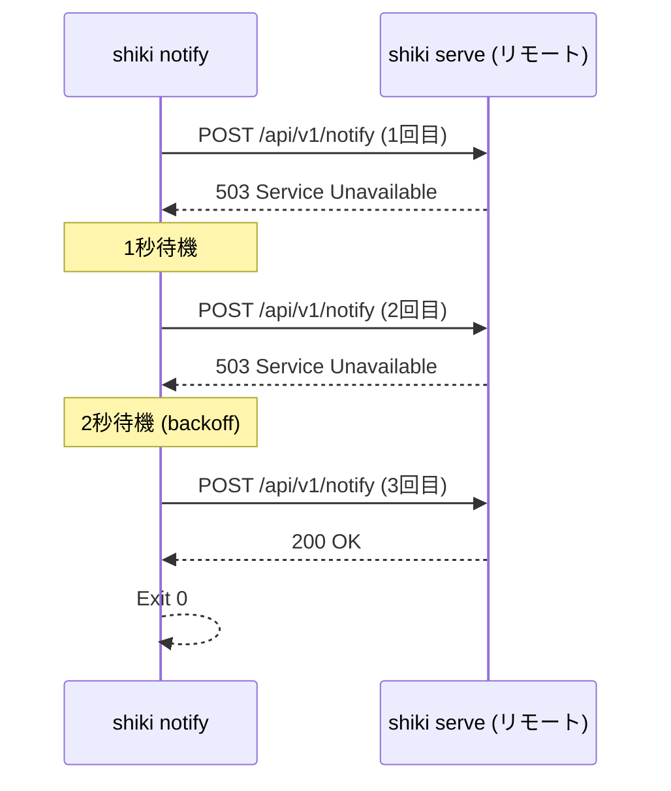

# SPECIFICATION.md - shiki 機能仕様書

> **Version**: 0.2.0  
> **Last Updated**: 2025-12-30  
> **Status**: Draft

---

## 1. 概要

### 1.1 システム目的

shiki は、複数マシン間・複数コンテナ間でサービスの起動順序を HTTP ベースで連携させる軽量エージェントです。

### 1.2 適用範囲

- Linux 環境（systemd 環境）
- Docker コンテナ内（systemd 非対応環境）
- ホスト OS 上での直接実行

### 1.3 前提条件

- ネットワーク経由で他のエージェントと通信可能であること
- **systemd バックエンド**: systemd が動作し、systemctl の実行権限があること
- **exec バックエンド**: 定義したコマンドの実行権限があること

---

## 2. エージェント仕様

### 2.1 動作モード

| モード | 説明 | 用途 |
|--------|------|------|
| `serve` | HTTP サーバーとして常駐 | 通知を受信し、ローカルサービスを操作 |
| `notify` | 他エージェントへ通知送信 | ExecStartPre 等から呼び出し |
| `wait` | 通知を待機 | 他サービスの準備完了を待つ |
| `status` | エージェント状態確認 | ヘルスチェック・デバッグ |
| `config` | 設定ファイル操作 | 検証・表示 |

### 2.2 CLI インターフェース

```
shiki [OPTIONS] <COMMAND>

COMMANDS:
    serve     HTTP サーバーを起動し、通知を待ち受ける
    notify    リモートエージェントへ通知を送信する
    wait      リモートエージェントからの通知を待機する
    status    エージェントまたはサービスの状態を確認する
    config    設定ファイルの検証・表示を行う
    help      ヘルプを表示する

OPTIONS:
    -c, --config <PATH>    設定ファイルパス [default: /etc/shiki/config.yaml]
    -v, --verbose          詳細ログ出力（複数指定で増加: -vv, -vvv）
    -q, --quiet            エラーのみ出力
    -h, --help             ヘルプを表示
    -V, --version          バージョンを表示
```

### 2.3 サブコマンド詳細

#### `shiki serve`

```
shiki serve [OPTIONS]

OPTIONS:
    --bind <ADDR>     バインドアドレス [default: 0.0.0.0]
    --port <PORT>     リッスンポート [default: 8080]
```

#### `shiki notify`

```
shiki notify [OPTIONS] --target <TARGET> --action <ACTION> --service <SERVICE>

OPTIONS:
    -t, --target <TARGET>      通知先アドレス (host:port)
    -a, --action <ACTION>      アクション (start|stop|restart)
    -s, --service <SERVICE>    対象サービス名
    -w, --wait                 完了まで待機 [default: true]
    --timeout <SECONDS>        タイムアウト秒数 [default: 60]
    --no-wait                  完了を待たない
```

#### `shiki status`

```
shiki status [OPTIONS]

OPTIONS:
    --target <TARGET>     リモートエージェントの状態を確認
    --service <SERVICE>   サービス状態を確認（ローカル）
```

#### `shiki wait`

```
shiki wait [OPTIONS] --target <TARGET> --service <SERVICE>

OPTIONS:
    -t, --target <TARGET>      待機対象のエージェント (host:port)
    -s, --service <SERVICE>    待機対象のサービス名
    --timeout <SECONDS>        タイムアウト秒数 [default: 60]
    --interval <SECONDS>       ポーリング間隔 [default: 5]
```

`wait` コマンドは、指定したリモートエージェント上のサービスが `running` 状態になるまで待機します。

**使用例:**

```bash
# DB サービスが起動するまで待機（最大60秒）
shiki wait --target db-server:8080 --service postgresql --timeout 60

# 短いポーリング間隔で待機
shiki wait --target api:8080 --service myapp --interval 2 --timeout 120
```

#### `shiki config`

```
shiki config <SUBCOMMAND>

SUBCOMMANDS:
    validate    設定ファイルを検証する
    show        現在の設定を表示する
```

---

## 3. エージェントライフサイクル

### 3.1 状態遷移図



### 3.2 状態一覧

| 状態 | 説明 | HTTP レスポンス |
|------|------|-----------------|
| `Initializing` | 起動中、設定読み込み中 | 503 Service Unavailable |
| `Ready` | リクエスト受付可能 | 200 OK |
| `Processing` | リクエスト処理中 | 200 OK |
| `Error` | 一時的エラー、復旧待ち | 503 Service Unavailable |
| `Shutdown` | シャットダウン中 | 503 Service Unavailable |
| `Failed` | 致命的エラー、終了待ち | N/A（プロセス終了） |

---

## 4. 通知フロー仕様

### 4.1 通知トリガー条件

| トリガー | 説明 | 使用例 |
|----------|------|--------|
| **ExecStartPre** | サービス起動前に実行 | 依存サービスの起動を待つ |
| **ExecStartPost** | サービス起動後に実行 | 依存先に起動完了を通知 |
| **ExecStopPost** | サービス停止後に実行 | 依存先に停止を通知 |
| **手動実行** | CLI から直接実行 | テスト・デバッグ |

### 4.2 通知シーケンス（成功時）



### 4.3 通知シーケンス（失敗・リトライ時）



### 4.4 リトライポリシー

| パラメータ | デフォルト値 | 説明 |
|------------|-------------|------|
| `max_retries` | 3 | 最大リトライ回数 |
| `retry_delay_ms` | 1000 | 初回リトライ遅延（ミリ秒） |
| `backoff_factor` | 2.0 | 指数バックオフ係数 |
| `max_delay_ms` | 30000 | 最大リトライ遅延（ミリ秒） |

**リトライ遅延計算式:**

```
delay = min(retry_delay_ms * (backoff_factor ^ attempt), max_delay_ms)
```

### 4.5 タイムアウト仕様

| パラメータ | デフォルト値 | 説明 |
|------------|-------------|------|
| `connect_timeout_seconds` | 5 | TCP 接続タイムアウト |
| `read_timeout_seconds` | 30 | HTTP レスポンス読み取りタイムアウト |
| `service_timeout_seconds` | 60 | サービス起動/停止待機タイムアウト |

---

## 5. サービス操作仕様

### 5.1 バックエンド

サービス操作は設定されたバックエンドに応じて実行されます。

| バックエンド | 説明 | 用途 |
|--------------|------|------|
| `systemd` | systemctl 経由でサービス操作 | ホスト環境 |
| `exec` | 任意コマンドでサービス操作 | Docker コンテナ、systemd 非対応環境 |

### 5.2 systemd バックエンド

| アクション | systemctl コマンド | 説明 |
|------------|-------------------|------|
| `start` | `systemctl start <service>` | サービスを起動 |
| `stop` | `systemctl stop <service>` | サービスを停止 |
| `restart` | `systemctl restart <service>` | サービスを再起動 |
| `status` | `systemctl is-active <service>` | 状態を確認（操作なし） |

### 5.3 exec バックエンド

設定ファイルで定義されたコマンドを実行します。

```yaml
agent:
  backend: exec
  services:
    nginx:
      start: "/usr/sbin/nginx"
      stop: "/usr/sbin/nginx -s quit"
      status: "pgrep -x nginx"
      working_dir: "/etc/nginx"
      env:
        - "NGINX_PORT=80"
    myapp:
      start: "/app/start.sh"
      stop: "/app/stop.sh"
      status: "/app/health.sh"
```

| 設定項目 | 必須 | 説明 |
|----------|------|------|
| `start` | Yes | サービス起動コマンド |
| `stop` | Yes | サービス停止コマンド |
| `status` | Yes | 状態確認コマンド（終了コード 0 = running） |
| `restart` | No | 再起動コマンド（未定義時は stop → start） |
| `working_dir` | No | 作業ディレクトリ |
| `env` | No | 環境変数リスト |

**status コマンドの終了コード:**
- `0`: running
- `0以外`: stopped

### 5.4 サービス状態

| 状態 | 説明 |
|------|------|
| `running` | サービスが稼働中 |
| `stopped` | サービスが停止中 |
| `failed` | サービスが異常終了 |
| `unknown` | 状態不明（サービス未登録等） |

### 5.5 サービスアクセス制御

設定ファイルで許可/拒否リストを定義可能：

```yaml
services:
  allowed:
    - nginx
    - postgresql
    - redis
  denied:
    - sshd
    - systemd-*
```

**評価順序:**
1. `denied` リストに一致 → 拒否
2. `allowed` リストが空 → 全許可
3. `allowed` リストに一致 → 許可
4. それ以外 → 拒否

---

## 6. エラーコード仕様

### 6.1 エラーコード一覧

| コード | 名前 | HTTP Status | 説明 |
|--------|------|-------------|------|
| `E001` | `CONFIG_INVALID` | - | 設定ファイルが不正 |
| `E002` | `SERVICE_NOT_FOUND` | 404 | 対象サービスが存在しない |
| `E003` | `SERVICE_DENIED` | 403 | サービス操作が許可されていない |
| `E004` | `BACKEND_ERROR` | 500 | バックエンド操作に失敗 |
| `E005` | `TIMEOUT` | 504 | 操作がタイムアウト |
| `E006` | `CONNECTION_ERROR` | 502 | リモートエージェントへの接続失敗 |
| `E007` | `AUTH_FAILED` | 401 | 認証失敗 |
| `E008` | `INVALID_REQUEST` | 400 | リクエストが不正 |
| `E009` | `AGENT_BUSY` | 503 | エージェントがビジー状態 |

### 6.2 エラーレスポンス形式

```json
{
  "success": false,
  "data": null,
  "error": {
    "code": "E002",
    "message": "Service not found: nginx",
    "details": {
      "service": "nginx",
      "suggestion": "Check if the service is installed and the name is correct"
    }
  },
  "timestamp": "2025-12-30T10:00:00Z"
}
```

---

## 7. 終了コード

CLI 実行時の終了コード：

| コード | 説明 |
|--------|------|
| 0 | 成功 |
| 1 | 一般的なエラー |
| 2 | 設定エラー |
| 3 | 接続エラー |
| 4 | タイムアウト |
| 5 | 認証エラー |
| 64 | コマンドライン引数エラー |

---

## 8. 制約事項

### 8.1 動作要件

| 項目 | 要件 |
|------|------|
| OS | Linux |
| アーキテクチャ | x86_64 / aarch64 / armv7 |
| Rust バージョン | 1.70 以上（ビルド時） |
| systemd バージョン | 219 以上（systemd バックエンド使用時） |

### 8.2 制限値

| 項目 | 制限値 | 変更可否 |
|------|--------|----------|
| 最大同時接続数 | 100 | 設定可能 |
| リクエストボディ最大サイズ | 1 MB | 固定 |
| サービス名最大長 | 256 文字 | 固定 |
| 管理対象サービス数 | 無制限 | - |
| 同時処理リクエスト数 | 10 | 設定可能 |

---

## 関連ドキュメント

- [DESIGN.md](DESIGN.md) - アーキテクチャ設計書
- [API.md](API.md) - REST API リファレンス
- [CONFIGURATION.md](CONFIGURATION.md) - 設定リファレンス
- [SYSTEMD_INTEGRATION.md](SYSTEMD_INTEGRATION.md) - systemd 連携ガイド
