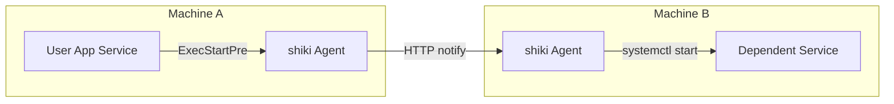

# SYSTEMD_INTEGRATION.md - systemd 連携ガイド

> **Version**: 0.1.0  
> **Last Updated**: 2025-12-30  
> **Status**: Draft

---

## 1. 概要

このドキュメントでは、shiki と systemd を連携させる方法を説明します。

### 1.1 連携パターン

| パターン | 説明 | 用途 |
|----------|------|------|
| **A** | shiki を systemd サービスとして実行 | エージェントの常駐 |
| **B** | ExecStartPre/Post で shiki notify を呼び出し | 依存サービスの起動連携 |
| **C** | A + B の組み合わせ | 本番運用（推奨） |

### 1.2 連携アーキテクチャ



---

## 2. shiki エージェント用ユニットファイル

### 2.1 基本構成

```ini
# /etc/systemd/system/shiki.service

[Unit]
Description=shiki - systemd service coordination agent
Documentation=https://github.com/pirakansa/shiki
After=network-online.target
Wants=network-online.target

[Service]
Type=simple
ExecStart=/usr/local/bin/shiki serve
ExecReload=/bin/kill -HUP $MAINPID
Restart=on-failure
RestartSec=5

# セキュリティ設定
User=shiki
Group=shiki
NoNewPrivileges=yes
ProtectSystem=strict
ProtectHome=yes
PrivateTmp=yes
ReadWritePaths=/var/lib/shiki /var/log/shiki

# リソース制限
MemoryMax=256M
CPUQuota=50%

[Install]
WantedBy=multi-user.target
```

### 2.2 環境変数設定（オーバーライド）

```ini
# /etc/systemd/system/shiki.service.d/override.conf

[Service]
Environment="SHIKI_CONFIG=/etc/shiki/config.yaml"
Environment="SHIKI_LOG_LEVEL=info"
Environment="SHIKI_AUTH_TOKEN=your-secret-token"
Environment="RUST_BACKTRACE=1"
```

### 2.3 インストール手順

```bash
# 1. バイナリを配置
sudo cp shiki /usr/local/bin/
sudo chmod +x /usr/local/bin/shiki

# 2. ユーザー・グループを作成
sudo useradd -r -s /sbin/nologin shiki

# 3. ディレクトリを作成
sudo mkdir -p /etc/shiki /var/lib/shiki /var/log/shiki
sudo chown shiki:shiki /var/lib/shiki /var/log/shiki

# 4. 設定ファイルを配置
sudo cp config.yaml /etc/shiki/
sudo chmod 640 /etc/shiki/config.yaml
sudo chown root:shiki /etc/shiki/config.yaml

# 5. ユニットファイルを配置
sudo cp shiki.service /etc/systemd/system/
sudo systemctl daemon-reload

# 6. サービスを有効化・起動
sudo systemctl enable shiki
sudo systemctl start shiki

# 7. 状態確認
sudo systemctl status shiki
```

---

## 3. アプリケーション連携用ユニットファイル

### 3.1 ExecStartPre による事前通知

依存サービスが別マシンにある場合、起動前に通知を送信して待機します。

```ini
# /etc/systemd/system/myapp.service

[Unit]
Description=My Application
After=network-online.target shiki.service
Requires=shiki.service

[Service]
Type=simple

# 起動前: リモートの database サービスを起動
ExecStartPre=/usr/local/bin/shiki notify \
    --target db-server.example.com:8080 \
    --action start \
    --service postgresql \
    --wait \
    --timeout 120

ExecStart=/usr/local/bin/myapp

# 停止後: リモートに停止を通知（オプション）
ExecStopPost=-/usr/local/bin/shiki notify \
    --target db-server.example.com:8080 \
    --action stop \
    --service postgresql \
    --no-wait

Restart=on-failure

[Install]
WantedBy=multi-user.target
```

> **注意**: `ExecStopPost` の先頭 `-` は、失敗しても無視することを意味します。

### 3.2 複数依存関係の処理

```ini
# /etc/systemd/system/webapp.service

[Unit]
Description=Web Application with Multiple Dependencies
After=network-online.target

[Service]
Type=simple

# 依存サービスを順次起動
ExecStartPre=/usr/local/bin/shiki notify \
    --target db-server:8080 \
    --action start \
    --service postgresql \
    --wait \
    --timeout 120

ExecStartPre=/usr/local/bin/shiki notify \
    --target cache-server:8080 \
    --action start \
    --service redis \
    --wait \
    --timeout 60

ExecStartPre=/usr/local/bin/shiki notify \
    --target queue-server:8080 \
    --action start \
    --service rabbitmq \
    --wait \
    --timeout 90

ExecStart=/usr/local/bin/webapp

[Install]
WantedBy=multi-user.target
```

### 3.3 ヘルスチェック付き起動

リモートエージェントのヘルスチェックを確認してから起動します。

```ini
# /etc/systemd/system/myapp-with-health.service

[Unit]
Description=Application with Health Check

[Service]
Type=simple

# ヘルスチェック通過まで待機
ExecStartPre=/bin/sh -c '\
    for i in $(seq 1 60); do \
        /usr/local/bin/shiki status --target api-server:8080 && exit 0; \
        sleep 5; \
    done; \
    exit 1'

ExecStart=/usr/local/bin/myapp

[Install]
WantedBy=multi-user.target
```

---

## 4. Docker 環境での利用

### 4.1 Docker Compose 連携

```yaml
# docker-compose.yml

version: '3.8'

services:
  shiki-agent:
    image: pirakansa/shiki:latest
    command: serve
    ports:
      - "8080:8080"
    volumes:
      - ./config.yaml:/etc/shiki/config.yaml:ro
    environment:
      - SHIKI_LOG_LEVEL=info
      - SHIKI_AUTH_TOKEN=${SHIKI_AUTH_TOKEN}
    healthcheck:
      test: ["CMD", "shiki", "status"]
      interval: 30s
      timeout: 10s
      retries: 3

  app:
    image: myapp:latest
    depends_on:
      shiki-agent:
        condition: service_healthy
    environment:
      - SHIKI_TARGET=shiki-agent:8080
```

### 4.2 Dockerfile 例

```dockerfile
# Dockerfile

FROM debian:bookworm-slim

# shiki バイナリをコピー
COPY --from=builder /app/target/release/shiki /usr/local/bin/shiki

# 設定ディレクトリを作成
RUN mkdir -p /etc/shiki

# 非 root ユーザーで実行
RUN useradd -r -s /sbin/nologin shiki
USER shiki

EXPOSE 8080

ENTRYPOINT ["/usr/local/bin/shiki"]
CMD ["serve"]
```

### 4.3 コンテナからホストの systemd を操作

コンテナ内の shiki からホストの systemd サービスを操作する場合:

```yaml
# docker-compose.yml

services:
  shiki-agent:
    image: pirakansa/shiki:latest
    command: serve
    ports:
      - "8080:8080"
    volumes:
      - ./config.yaml:/etc/shiki/config.yaml:ro
      # ホストの systemd ソケットをマウント
      - /run/systemd/system:/run/systemd/system:ro
      - /var/run/dbus:/var/run/dbus:ro
    # 特権が必要な場合
    privileged: true
```

> **セキュリティ警告**: ホストの systemd を操作する場合、セキュリティリスクを十分に検討してください。

---

## 5. 高度な設定

### 5.1 依存関係グラフ定義（将来実装）

複数のサービス依存関係を YAML で定義し、一括で起動順序を制御します。

```yaml
# /etc/shiki/dependencies.yaml

# 依存関係グラフ定義
dependencies:
  # グループ 1: データストア
  - name: database
    target: db-server:8080
    service: postgresql
    order: 1

  - name: cache
    target: cache-server:8080
    service: redis
    order: 1

  # グループ 2: メッセージキュー（データストア起動後）
  - name: queue
    target: queue-server:8080
    service: rabbitmq
    order: 2
    depends_on:
      - database

  # グループ 3: アプリケーション（全依存起動後）
  - name: app
    target: app-server:8080
    service: myapp
    order: 3
    depends_on:
      - database
      - cache
      - queue
```

```ini
# /etc/systemd/system/orchestrator.service

[Unit]
Description=Dependency Orchestrator

[Service]
Type=oneshot
RemainAfterExit=yes

# 設定ファイルに基づく一括起動
ExecStart=/usr/local/bin/shiki orchestrate \
    --config /etc/shiki/dependencies.yaml

# 逆順で停止
ExecStop=/usr/local/bin/shiki orchestrate \
    --config /etc/shiki/dependencies.yaml \
    --reverse

[Install]
WantedBy=multi-user.target
```

### 5.2 認証付き連携

```ini
# /etc/systemd/system/myapp-secure.service

[Unit]
Description=Secure Application with Authentication

[Service]
Type=simple

# 環境ファイルからトークンを読み込み
EnvironmentFile=/etc/shiki/credentials

ExecStartPre=/usr/local/bin/shiki notify \
    --target secure-server:8443 \
    --action start \
    --service backend \
    --wait

ExecStart=/usr/local/bin/myapp

[Install]
WantedBy=multi-user.target
```

```bash
# /etc/shiki/credentials
SHIKI_AUTH_TOKEN=your-secret-token-here
```

```bash
# パーミッション設定
sudo chmod 600 /etc/shiki/credentials
sudo chown root:root /etc/shiki/credentials
```

---

## 6. トラブルシューティング

### 6.1 よくある問題

| 症状 | 原因 | 対処 |
|------|------|------|
| ExecStartPre タイムアウト | ネットワーク遅延 / サービス起動遅延 | `--timeout` 値を増加 |
| Connection refused | Agent 未起動 | `After=shiki.service` を追加 |
| Permission denied | SELinux/AppArmor | ポリシー調整（下記参照） |
| Service not found | サービス名誤り | `systemctl list-units` で確認 |
| 認証エラー | トークン不一致 | 環境変数を確認 |

### 6.2 SELinux 対応

SELinux 有効環境では、カスタムポリシーが必要な場合があります。

```bash
# 監査ログを確認
sudo ausearch -m avc -ts recent

# 一時的に permissive モードで確認
sudo setenforce 0

# ポリシー生成
sudo audit2allow -a -M shiki
sudo semodule -i shiki.pp
```

### 6.3 デバッグコマンド

```bash
# ユニットファイル検証
systemd-analyze verify myapp.service

# 依存関係確認
systemctl list-dependencies myapp.service

# 起動順序確認
systemd-analyze critical-chain myapp.service

# ログ確認（リアルタイム）
journalctl -u shiki -u myapp -f

# shiki 接続テスト
shiki status --target remote-agent:8080

# 詳細ログで notify テスト
shiki notify \
    --target remote-agent:8080 \
    --action start \
    --service nginx \
    -vvv
```

### 6.4 ログ出力例

**正常起動時:**

```json
{"timestamp":"2025-12-30T10:00:00Z","level":"info","message":"Starting shiki agent","version":"0.1.0"}
{"timestamp":"2025-12-30T10:00:00Z","level":"info","message":"Listening on 0.0.0.0:8080"}
{"timestamp":"2025-12-30T10:00:01Z","level":"info","message":"Received notify request","service":"nginx","action":"start"}
{"timestamp":"2025-12-30T10:00:02Z","level":"info","message":"Service started successfully","service":"nginx","duration_ms":1234}
```

**エラー時:**

```json
{"timestamp":"2025-12-30T10:00:00Z","level":"error","message":"Failed to start service","service":"nginx","error":"Unit nginx.service not found"}
```

---

## 7. セキュリティ考慮事項

### 7.1 最小権限の原則

- shiki エージェントは専用ユーザーで実行
- `services.allowed` で操作可能なサービスを限定
- `services.denied` でセキュリティ重要なサービスを除外

### 7.2 ネットワークセキュリティ

- 本番環境では TLS を有効化
- ファイアウォールで shiki ポートへのアクセスを制限
- 認証トークンを有効化

```yaml
# 本番環境推奨設定
server:
  tls:
    enabled: true
    cert_path: "/etc/shiki/certs/server.crt"
    key_path: "/etc/shiki/certs/server.key"

auth:
  enabled: true
  method: "token"
```

### 7.3 監査ログ

重要な操作はログに記録されます。ログ集約システム（Elasticsearch、Loki 等）への転送を推奨します。

```yaml
logging:
  level: "info"
  format: "json"
  output: "stdout"  # コンテナ環境では stdout 推奨
```

---

## 関連ドキュメント

- [DESIGN.md](DESIGN.md) - アーキテクチャ設計書
- [SPECIFICATION.md](SPECIFICATION.md) - 機能仕様書
- [API.md](API.md) - REST API リファレンス
- [CONFIGURATION.md](CONFIGURATION.md) - 設定リファレンス
- [examples/config.example.yaml](examples/config.example.yaml) - 設定ファイルサンプル
